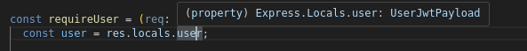

# Leson Two

## Contents of this Lesson

- [ ] CORS util
- [ ] Logging w/ pino
- [ ] Session Model
- [ ] Types
  - [ ] Error Types
  - [ ] Express Type Expansion
  - [ ] Handler Types
- [ ] JWT Util
  - [ ] JWT Types
- [ ] Deserialize User Middleware

## 1. Adding Pino

Pino is a library that allows us to have better logging in our backend application.

```bash
npm install pino dayjs pino-pretty lodash
npm install -D @types/lodash
```

```typescript
// util/logger.util.ts
import logger from "pino";
import dayjs from "dayjs";
import { checkEnv } from "./env.util";


export default logger({
    transport: {
        target: "pino-pretty",
    },
    base: {
        pid: false
    },
    timestamp: () => `,"time":"${dayjs().format()}"`,
    level: checkEnv().LOG_LEVEL
});
```


```typescript
logger.info("...");
logger.warn("...");
logger.error("...");
```

**Add LOG_LEVEL to our env util:**

```typescript
// env.util.ts
LOG_LEVEL: string().default("info").refine(e => ["trace", "debug", "info", "warn", "error", "fatal"].includes(e), "LOG_LEVEL must be one of trace, debug, info, warn, error, fatal"),
```

## 2. Adding CORS

### 2.1 What is CORS

**Cross-Origin Resource Sharing** is a browser security feature that controls how resources on a web page can be requested from a different origin.

- The `cors` package simplifies the configuration by handling the headers of every request according to the configuration set at the start
- Automatically handles preflight checks done by browsers (`HTTP OPTIONS`)

### 2.2 How do we implement it?

```bash
npm install cors
npm install -D @types/cors
```

```typescript
// util/cors.util.ts
import cors from "cors";

export default cors({
    credentials: true,
    origin: [`http://localhost:${process.env.PORT}`, "http://localhost:3000"],
});
```


```typescript
// src/index.ts
import cors from "./util/cors.util";

// ...

app.use(cors);

// ...
```

## 3. Adding Error Types

```typescript
// types/errors.ts
export enum ErrorCode {
    USER_NOT_FOUND = "USER_NOT_FOUND",
    VALIDATION_ERROR = "VALIDATION_ERROR",
    PERMISSION_DENIED = "PERMISSION_DENIED",
    ITEM_NOT_FOUND = "ITEM_NOT_FOUND",
    DATABASE_ERROR = "DATABASE_ERROR",
    UNAUTHORIZED = "UNAUTHORIZED",
    FORBIDDEN = "FORBIDDEN",
    BAD_REQUEST = "BAD_REQUEST",
    DUPLICATE_ENTRY = "DUPLICATE_ENTRY",
    INTERNAL_SERVER_ERROR = "INTERNAL_SERVER_ERROR",
    NOT_IMPLEMENTED = "NOT_IMPLEMENTED",
    SERVICE_UNAVAILABLE = "SERVICE_UNAVAILABLE",
    TIMEOUT = "TIMEOUT",
    INVALID_PASSWORD = "INVALID_PASSWORD",
    NO_PASSWORD_STORED = "NO_PASSWORD_STORED",
    INVALID_INPUT = "INVALID_INPUT"
}

export class ApplicationError extends Error {
    errorCode: ErrorCode;

    constructor(message: string, statusCode: ErrorCode) {
        super(message);
        this.errorCode = statusCode;
        Error.captureStackTrace(this, this.constructor);
    }
}
```


## 4. Adding JWT

### 4.1 How does JWT Auth Work?

- JWT = JSON Web Token
  - Effectively a signed JSON Document
  - Consists of 3 parts base64-urlencoded and joined by dots (`.`):
    - **Header:** Contains meta information such as the algorithm used
    - **Payload:** The "claims" such as user information or roles & permissions
    - **Signature:** The signature produced by the server with its private key upon giving out the JWT
  - Signature: Server computes a signature with its private key

Allows the server to not ask the database every time for authentication.

Opens the user up to stealing of the JWT.

Security measures:

- Short Lifespan of JWTs
  - Few minutes to max. a few hours
- ALWAYS use **HTTPS**
- Mitigate CSRF Attacks (Cross-Site-Request-Forgery)
  - SameSite=Strict or SameSite=La
- Protect against Brute-Force
  - Rate Limit Login Endpoints
- No sensitive data such as Passwords
- Monitor & Log usage
- Token Issuance and Revocation
  - Issue new tokens upon significant events (e.g. password change and user logout)
  - Invalidate tokens immediately if a breach or compromise was detected
    - This is an advanced feature to be implemented for example with a redis cache, where the server would keep a blacklist of tokens.
    - Alternative is to just keep token lifetimes short
  - Rotate Signing Keys frequently (effectively large-scale invalidation)
  - User Versioning
    - Effectively has a user version number which is incremented with every logout which the server keeps track of
    - If a token comes in which has an old version of the token, then the server knows not to accept this token

Our approach here:

- Short Lifespan of the Access Token
- Check validity of the Refresh Token in the database
  - A logout invalidates the token in the database and disallows reaquiring a access token based on this refresh token.

### 4.2 Installing Packages

```bash
npm install jsonwebtoken bcrypt
npm install -D @types/jsonwebtoken
```

### 4.3 JWT Types

```typescript
export type UserJwtPayload = {
    _id: string;
    username: string;
    sessionId: string;
    exp?: number; // expiration date
    iat?: number; // issued at
}

export type VerifyJwtResult = {
    valid: boolean;
    expired?: boolean;
    decoded?: UserJwtPayload;
    error?: string | null;
}
```

### 4.4 Express Namespace Expansion

Why do we need it?
How do we do it?

```typescript
// types/express/index.d.ts

import { UserJwtPayload } from "../jwt.types"

declare global {
  namespace Express {
    interface Locals {
      user: UserJwtPayload,
      error: string | null
    }
  }
}
```

**Later Benefit:**

Perfect typing:



```typescript
async function handleRequest(req: Request, res: Response) {
    const user = res.locals.user; // recognized as of type UserJwtPayload
}
```

### 4.5 JWT Relevant Env Variables

*How do we configure our service?*

```typescript
import { object, coerce, string } from "zod";
import { config } from "dotenv";

config();

const envSchema = object({
  PORT: coerce
    .number({
      message: "Port must be a number",
    })
    .min(0)
    .max(65536),
  MONGO_URL: string({
    message: "MongoDB URL is required!",
  }),
  SALT_WORK_FACTOR: coerce
    .number({
      message: "SALT_WORK_FACTOR must be a number",
    })
    .min(4)
    .max(31),

  // the number of seconds the access token is valid for
  ACCESS_TOKEN_TTL: coerce
    .number({
      message: "ACCESS_TOKEN_TTL must be a number",
    })
    .min(60) // 1m minimum
    .default(900), // 15m default

  // the number of seconds the refresh token is valid for
  REFRESH_TOKEN_TTL: coerce
    .number({
        message: "REFRESH_TOKEN_TTL must be a number",
    })
    .min(3600) // 1h minimum
    .default(604800), // 7d default
  PRIVATE_KEY_FILE: string({
    required_error: "PRIVATE_KEY_FILE is required.",
  }),
  PUBLIC_KEY_FILE: string({
    required_error: "PUBLIC_KEY_FILE is required.",
  }),
  LOG_LEVEL: string()
    .default("info")
    .refine(
      (e) => ["trace", "debug", "info", "warn", "error", "fatal"].includes(e),
      "LOG_LEVEL must be one of trace, debug, info, warn, error, fatal"
    ),
});

export default envSchema.parse(process.env);
```

- Salt Work Factor, aka cost factor or log rounds
  - How many rounds of hashing will be done on the password
  - typically between 4 and 31
  - 10 = 2^10 = 1024 iterations of hashing
  - 12 = 2^12 = 4096 iterations of hashing
- Access Token TTL
  - TTL = Time To Live
    - How long the access token stays valid
- Refresh Token TTL
  - What could that be?
- Private Key File
  - The file containing the private key for sigining the JWTs
- Public Key File
  - The file containing the public key for verifying the JWTs

*One might now ask, how do we get a RSA Keypair?*

### 4.6 JWT Util

```typescript
// util/jwt.util.ts

import jwt from 'jsonwebtoken';
import { UserJwtPayload, VerifyJwtResult } from '../types/jwt.types';

export function signJwt(object: UserJwtPayload, options?: jwt.SignOptions): string {
    return jwt.sign(object, process.env.PRIVATE_KEY!, {
        algorithm: 'RS256',
        ...(options || {})
    });
}

/**
 * Verifies a JWT using the public key.
 * @param {string} token - The JWT to verify.
 * @returns {object} An object containing the verification result.
 * @property {boolean} valid - Indicates if the JWT is valid.
 * @property {boolean} expired - Indicates if the JWT is expired.
 * @property {object|null} decoded - The decoded JWT payload, or null if the JWT is not valid.
 * @property {string|null} error - The error message, or null if the JWT is valid.
 */
export function verifyJwt(token: string): VerifyJwtResult {
    try {
        const decoded = jwt.verify(token, process.env.PUBLIC_KEY!) as UserJwtPayload;

        return {
            valid: true,
            expired: false,
            decoded,
            error: null
        }
    } catch (e: any) {
        let error = 'Invalid token';
        let decoded;

        if (e instanceof jwt.TokenExpiredError) {
            error = 'Token expired';

            // try to decode the token to get the user information
            decoded = jwt.decode(token) as UserJwtPayload;
        } else if (e instanceof jwt.NotBeforeError) {
            error = 'Token not active';
        } else if (e instanceof jwt.JsonWebTokenError) {
            error = e.message;
        }

        return {
            valid: false,
            expired: e instanceof jwt.TokenExpiredError,
            decoded,
            error
        };
    }
}
```

### 4.7 Session Model


```typescript
// model/session.model.ts
import mongoose from "mongoose";
import { UserDocument } from "./user.model";

export type Session = {
    userId: UserDocument["id"];
    valid: boolean;
    userAgent: string;

    createdAt?: Date;
    updatedAt?: Date;
};

export type SessionDocument = mongoose.Document<string> & Session;

const sessionSchema = new mongoose.Schema<SessionDocument>({
    userId: { type: mongoose.Types.ObjectId, ref: "User", required: true },
    valid: { type: Boolean, required: true, default: true },
    userAgent: { type: String },
},
    // add timestamps, remove __v from toJSON and toObject and show id as string
    {
        timestamps: true,
        toJSON: {
            virtuals: true,
            transform: function (doc, ret) {
                ret.id = ret._id.toString();
                delete ret._id;
                delete ret.__v;
            }
        },
        toObject: {
            virtuals: true,
            transform: function (doc, ret) {
                ret.id = ret._id.toString();
                delete ret._id;
                delete ret.__v;
            }
        }
    }
);

const SessionModel = mongoose.model<SessionDocument>("Session", sessionSchema);

export default SessionModel;
```

### 4.8 Handler Type

@[christian](https://github.com/Christian-Hoeller) what the name of typescript is this magic?

```typescript
// types/handler.types.ts
import type { NextFunction, Request, Response } from "express";

export type CustomSchemaExpressHandler<
    Schema extends {
        body?: Object;
        params?: Object;
        query?: Object;
    } = {},
> = (
    req: Request<Schema["params"], {}, Schema["body"], Schema["query"]>,
    res: Response<{}>,
    next: NextFunction,
) =>
        | Promise<Response<any, Record<string, any>> | undefined>
        | Response<any, Record<string, any>>
        | undefined;
```

### 4.9 Session Service

```typescript
// service/session.service.ts
import { Types } from "mongoose";
import Session, { SessionDocument } from "../model/session.model";
import { signJwt, verifyJwt } from "../util/jwt.util";
import { getUser } from "./user.service";
import SessionModel from "../model/session.model";
import logger from "../util/logger.util";
import { UserDocument } from "../model/user.model";
```

**Creating a Session:**

```typescript
/**
 * Creates a new session for a given user
 * @param userId The userId the session is for
 * @param userAgent The userAgent the user is requesting a new session from
 * @returns a new session
 */
export async function createSession(userId: string, userAgent: string) {
    const session = await Session.create({ userId: userId, userAgent });
    return session;
}
```

*How does the user log in?*

**Creating a pair of Tokens:**

```typescript
/**
 * Creates a pair of access and refresh tokens for a given user.
 *
 * @param user The user to create the tokens for.
 *
 * @returns An object containing the access and refresh tokens.
 */
export async function issueTokens(
  user: UserDocument,
  userAgent: string
): Promise<{ accessToken: string; refreshToken: string }> {
  const session = await createSession(user._id.toString(), userAgent);

  const userInfo = {
    _id: user._id.toString(),
    email: user.email,
    sessionId: session._id,
  };

  // create new access JWT
  const accessToken = signJwt(userInfo as UserJwtPayload, {
    expiresIn: env.ACCESS_TOKEN_TTL,
  });

  // create new refresh JWT
  const refreshToken = signJwt(userInfo as UserJwtPayload, {
    expiresIn: env.REFRESH_TOKEN_TTL,
  });

  return { accessToken, refreshToken };
}
```

*What do we do now if a user comes to us with a token when using our services?*

**Validate a Given Session:**

```typescript
/**
 * Validates a session for a given session id.
 * 
 * @param id the session id
 * @returns true if the session is valid
 */
export async function validateSessionWithId(id: Types.ObjectId) {
    try {
        const session = await SessionModel.findById(id);
        return session !== null && session.valid;
    } catch (e) {
        throw new Error(`Failed to validate session: ${(e as Error).message}`);
    }
}
```

*What if the users access token has expired?*

**Re-Issue a Access Token Based on a Given Refresh Token:**

```typescript
/**
 * Reissues an access token if the refresh token and session are valid.
 * 
 * @param refreshToken The refresh token to verify.
 * @returns A new access token or an error message.
 */
export async function reIssueAccessToken(refreshToken: string): Promise<{ error: string, jwt: string | false }> {
    const { decoded, valid, error } = verifyJwt(refreshToken);

    if (!valid || !decoded) {
        logger.warn(`{Session Service | Re-Issue Access Token} - Refresh token verification failed: ${error}`);
        return { jwt: false, error: "Invalid refresh token" };
    }

    try {
        const session = await Session.findById(decoded.sessionId);
        if (!session || !session.valid) {
            logger.warn(`{Session Service | Re-Issue Access Token} - Session ${decoded.sessionId} invalid or not found`);
            return { jwt: false, error: "Invalid session" };
        }

        const user = await findUserById(session.userId);
        if (!user) {
            logger.warn(`{Session Service | Re-Issue Access Token} - User ${session.userId} not found for session ${decoded.sessionId}`);
            return { jwt: false, error: "User not found" };
        }

        const accessToken = signJwt({
            _id: user._id,
            username: user.username,
            role: user.role,
            sessionId: session._id
        }, { expiresIn: process.env.ACCESS_TOKEN_TTL });

        return { jwt: accessToken, error: "" };

    } catch (err) {
        logger.error(`{Session Service | Re-Issue Access Token} - Error in re-issuing access token: ${err}`);
        return { jwt: false, error: 'Error processing refresh token' };
    }
}
```

*What if the user wants to log out now?*

**Invalidate a Session:**

```typescript
/**
 * Invalidates a session by setting its valid flag to false.
 * @param sessionId The ID of the session to invalidate.
 */
export async function invalidateSession(sessionId: SessionDocument["_id"]): Promise<void> {
    try {
        await SessionModel.findByIdAndUpdate(sessionId, { valid: false });
        logger.info(`{Session Service | Invalidate Session} - Session ${sessionId} invalidated successfully.`);
    } catch (error) {
        logger.error(`{Session Service | Invalidate Session} - Failed to invalidate session ${sessionId}: ${(error as Error).message}`);
        throw new Error(`Failed to invalidate session: ${(error as Error).message}`);
    }
}
```

*What if the user wants to log in but has an already active session?*

**Invalidate All Prior Sessions For A User:**

```typescript
/**
 * This function invalidates all sessions for a given user
 * @param userId the ObjectId from the user to invalidate all sessions for
 */
export async function invalidateAllSessionsForUser(userId: UserDocument["_id"]): Promise<number> {
    const sessions = await SessionModel.updateMany({ userId, valid: true }, { valid: false });

    logger.info(`{Session Service | Invalidate All Sessions For User} - Invalidated ${sessions.modifiedCount} session${sessions.modifiedCount > 1 ? 's': ''} for user ${userId}.`);

    return sessions.modifiedCount;
}
```


*What if a user now wants to log in with his credentials?*

**Validate User Credentials**


```typescript
/**
 * Check if the user exists in the database and the password matches
 * @param email User's email
 * @param password User's password
 * 
 * @returns the user if the email is registered and the provided password matches
 * 
 * @throws If the user is not found
 * @throws If the user has no password stored
 * @throws If the user has an invalid password
 */
export async function validateUserCredentials(email: string, password: string) {
  logger.info(`{User Service | Validate User Credentials} - Validating credentials for user with email "${email}"...`);

  const user = await UserModel.findOne({ email }, { __v: false }).exec();

  if (!user) {
    throw new ApplicationError(`User with email "${email}" not found`, ErrorCode.USER_NOT_FOUND);
  }

  logger.debug(`{User Service | Validate User Credentials} - User found: ${user.username}`);

  // check if a password is set for the user (could be oauth user)
  if (!user.password) {
    throw new ApplicationError("No password stored on user - please use OAuth to login", ErrorCode.NO_PASSWORD_STORED);
  }

  // verify password
  const isMatch = await bcrypt.compare(password, user.password);
  if (!isMatch) {
    throw new ApplicationError("Invalid password", ErrorCode.INVALID_PASSWORD);
  }

  return omit(user, "password", "__v");
}
```


### 4.10 Session Controller

Handles the session logic from our service.

To allow a user to log in with a given e-mail and password, we need to actually check if the given information matches the information in our database.

```typescript
// controller/session.controller.ts
import { Request, Response } from "express";
import { Error as MongooseError } from "mongoose";
import type { MongoServerError } from "mongodb";
import { pick } from "lodash";

import logger from "../util/logger.util";

import { LoginUserInput, RegisterUserInput, RefreshAccessTokenInput } from "../schema/session.schema";
import type {  } from "../schema/session.schema";

import { signJwt } from "../util/jwt.util";

import { createSession, invalidateAllSessionsForUser, reIssueAccessToken } from "../service/session.service";
import { createUser, validateUserCredentials } from "../service/user.service";

import { UserJwtPayload } from "../types/jwt.types";
import { ApplicationError, ErrorCode } from "../types/errors";
import { CustomSchemaExpressHandler } from "../types/handler.types";
```

*User wants to log in providing us with his credentials:*

**User Login = Creating a new Session:**

```typescript
/**
 * Handles the login of a user.
 * @param req A request containing the input required for a login procedure
 */
export const loginHandler: CustomSchemaExpressHandler<LoginUserInput> = async (req, res) => {
    try {
        logger.debug(`{Login Handler | Login Handler} - Validating credentials for user ${req.body.email}...`);

        const user = await validateUserCredentials(req.body.email, req.body.password);

        logger.debug(`{Login Handler | Login Handler} - User ${user.email}(_id: ${user._id}) successfully validated. Creating session...`);

        // check if a session is currently active (should not be - just for consistency)
        const invalidated = await invalidateAllSessionsForUser(user._id);

        if (invalidated > 0) {
            logger.warn(`{Auth Controller | Login Handler} - Found valid session in the login process. Be aware for inconsistencies! - userId="${user._id}" - Invalidating...`);
        }

        // create new session
        const session = await createSession(user._id, req.headers['user-agent'] ?? "not defined");

        logger.debug("{Auth Controller | Login Handler} - session created: " + session.id + "for user " + user.email);

        // create user info object to sign jwt with
        const userinfo = {...pick(user, ["_id", "username", "email", "role"]), sessionId: session._id};

        // create new access JWT
        const access_token = signJwt( userinfo as UserJwtPayload, { expiresIn: process.env.ACCESS_TOKEN_TTL } );

        // create new refresh JWT
        const refresh_token = signJwt( userinfo as UserJwtPayload, { expiresIn: process.env.REFRESH_TOKEN_TTL } );

        return res.status(200).json({
            access_token,
            refresh_token,
            user: user
        })
    } catch (e) {
        if (e instanceof ApplicationError) {
            const err = e as ApplicationError;

            if (err.errorCode === ErrorCode.USER_NOT_FOUND) {
                logger.warn(`{Auth Controller | Login Handler} - User ${req.body.email} not found.`);
                return res.status(404).json({ message: err.message });
            }
        }

        logger.warn(`{Auth Controller | Login Handler} - Error while logging in user ${req.body.email}: [${(e as Error).name}]: ${(e as Error).message}`);
        res.status(401).json({ message: (e as Error).message });
    }
}
```

*What if the users Access Token has expired?*

**Refresh Access Token:**

```typescript
/**
 * Issues a new access token for a given refresh token if it is still valid.
 * @param req A request containing the x-refresh header with the refresh token
 * @param res Responds with a json body containing the new access token if the procedure succeeded
 */
export const refreshAccessTokenHandler: CustomSchemaExpressHandler<RefreshAccessTokenInput> = async (req, res) => {
    logger.debug(`{Auth Controller | Refresh Access Token} - Attempting to issue new access token for refresh token: '${req.body.refresh_token.slice(0, 10)}...${req.body.refresh_token.slice(-10)}'`);

    const at = await reIssueAccessToken(req.body.refresh_token);

    if (at.error) {
        logger.warn(`{Auth Controller | Refresh Access Token} - User tried to get new access token with invalid refresh token: ${at.error} | '${req.body.refresh_token.slice(0, 10)}...${req.body.refresh_token.slice(-10)}'`);

        return res.status(401).json({ error: at.error });
    }

    res.status(200).json({
        access_token: at.jwt
    });
}
```

*The user is done playing and wants to log out.*

**Logging out = Invalidating the Session:**

```typescript
/**
 * Invalidates a session for a user
 * @param res response containing locals with the session id to invalidate
 */
export async function logoutHandler(
    _: Request,
    res: Response
) {
    try {
        const invalidated_count = await invalidateAllSessionsForUser(res.locals.user._id);

        logger.debug(`{Auth Controller} - Succesfully processed logout request for user ${res.locals.user._id} - Invalidated session${invalidated_count > 1 ? "s" :""}: ${invalidated_count}`);
        return res.status(200).json({
            message: "Successfully logged out."
        });
    } catch (e) {
        logger.error(`{Auth Controller} - Error invalidating session(s) for user ${res.locals.user._id}: `, e);
        return res.status(500).send(e);
    }
}
```

*But wait, how will we know in the requests if the user is logged in?*

### 4.12 Deserializing the JWT in the requests

```typescript
// middleware/deserializeUser.ts
import { NextFunction, Request, Response } from "express";
import { verifyJwt } from "../util/jwt.util";
import logger from "../util/logger.util";

/**
 * This middleware handles the verification and deserialization of the user information stored in a provided jwt
 * @param req A request containing the jwt in the "Authentication" header as Bearer token
 * @param res 
 * @param next 
 * @returns 
 */
export async function deserializeUser(req: Request, res: Response, next: NextFunction) {
  const accessToken = req.headers.authorization?.replace(/^Bearer\s/, "");

  // no access token
  if (!accessToken) {
    res.locals.error = "No access token provided.";
    return next();
  }

  const { valid, expired, decoded, error } = verifyJwt(accessToken);

  if (decoded) {
    logger.debug(`{Deserialize User} - Session ID from decoded JWT: ${decoded.sessionId} - valid: ${!expired} - url: ${req.url}`);
    try {
      
      if (!expired) {
        // Continue with valid decoded information
        res.locals.user = decoded;
        logger.debug(`{Deserialize User} - User ${decoded._id} deserialized from JWT`);
      } else {
        // Token expired
        res.locals.error = "Access token expired.";
      }
      
      return next();
    } catch (error) {
      logger.error("Error processing JWT: " + (error as Error).message);
      return res.status(500).json({ error: 'Internal server error during JWT processing' });
    }
  } else { // otherwise invalid token
    logger.warn(`{Deserialize User} - Access token invalid: ${error} | '${accessToken.slice(0, 10)}...${accessToken.slice(-10)}'`);
    res.locals.error = "Access token invalid."
    return next();
  }
}
```

*What if the user is logged in and tries to log in again?*

### 4.13 Logged In Middleware

```typescript
// middleware/loggedInRedirect.ts
import { NextFunction, Request, Response } from "express";
import logger from "../util/logger.util";

export function loggedInRedirect(req: Request, res: Response, next: NextFunction) {
    if (res.locals.user) {
        logger.debug(`Logged in user tried to go to login/signup page | sid:${res.locals.user.sessionId}`);
        return res.redirect('/');
    }

    next();
}

export default loggedInRedirect;
```

*What if we have a user that strictly requires a user to be logged in?*

### 4.14 Require User Middleware

```typescript
// middleware/requireUser.ts
import { NextFunction, Response, Request } from "express";

const requireUser = (req: Request, res: Response, next: NextFunction) => {
  const user = res.locals.user;

  if (!user) {
    return res
      .status(401)
      .json({ message: res.locals.error ?? "Unauthorized" });
  }
  
  return next();
};

export default requireUser;
```

### 4.15 Generating a RSA Keypair

```bash
# gen-keys.sh
mkdir -p rsa
openssl genrsa -out rsa/private.key 4096
openssl rsa -pubout -in rsa/private.key -out rsa/public.key
```

```bash
sudo chmod +x ./gen-keys.sh
```

### 4.16 Session Router

```typescript
import { Request, Response, NextFunction, Router } from "express";
import loggerUtil from "../util/logger.util";
import validate from "../middleware/validateResource";
import { loginUserSchema, refreshAccessTokenSchema, registerUserSchema } from "../schema/auth.schema";
import requireUser from "../middleware/requireUser";
import { loginHandler, logoutHandler, refreshAccessTokenHandler, registerHandler } from "../controller/auth.controller";

const router = Router();

// ...

export default router;
```

*What routes will we now need in the session router?*

```typescript
// log in with email and password
router.post('/login', [loggedInRedirect, validate(loginUserSchema)], loginHandler)

// route for getting a new access token from the refresh token
router.post('/refresh', [validate(refreshAccessTokenSchema)], refreshAccessTokenHandler);

// logout route
router.post('/logout', requireUser, logoutHandler);
```